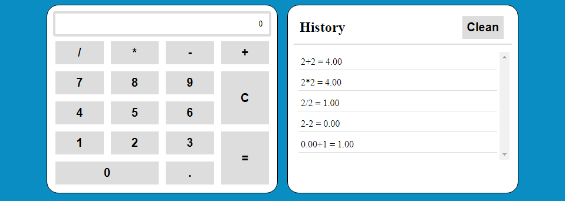
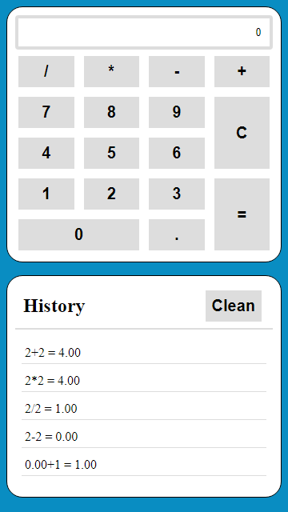

# Calculator

<h2 align="center">
  
</h2>

  

  
  

  

  

  

## 💻 Projeto

Aplicação feita em [React] utilizando o react context.

## - 🌐 Web

[Calculator]

### 🖥️ Desktop

<h1 align="center">
    
</h1>

### 📱 Mobile

<h1 align="center">
    
</h1>

## 🚀 Tecnologias

Esse projeto foi desenvolvido com as seguintes tecnologias:

- [React](https://reactjs.org)
- [HTML](https://www.w3schools.com/html/)
- [CSS](https://www.w3schools.com/css/)

[calculator]: https://react-calculator-luizpedrosm.netlify.app/
[react]: https://reactjs.org
